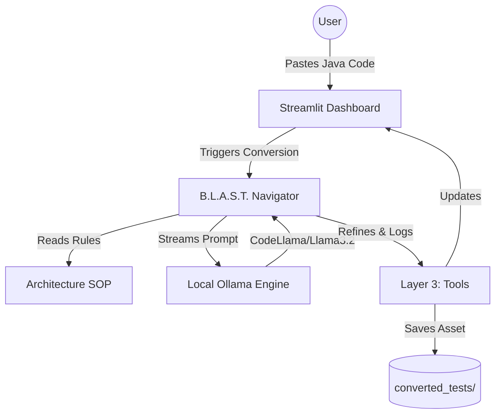

# 🚀 B.L.A.S.T. Selenium-to-Playwright Converter

A premium, local-first automation migration tool built with **Streamlit** and **Ollama (CodeLlama)**. This tool leverages the **B.L.A.S.T. Protocol** (Blueprint, Link, Architect, Stylize, Trigger) to ensure deterministic and high-fidelity test conversions.

## 📊 System Architecture



## ✨ Features
- **Deterministic Conversion:** Uses an Architecture-driven SOP to map Selenium Java to Playwright TypeScript.
- **Local-Only Processing:** Zero data leakage; all processing happens via your local Ollama instance.
- **Premium UI:** Glassmorphism dashboard with real-time status tracking and progress visualization.
- **Real-time Streaming:** See the code being generated word-by-word.
- **Self-Healing Output:** Automatically cleans up markdown formatting and strips conversational noise.
- **Automatic Export:** Converted tests are timestamped and saved to the `converted_tests/` directory.

## 🏗️ Architecture (A.N.T Framework)
1.  **Architecture (SOP):** Located in `architecture/conversion_sop.md`. This is the "brain" that tells the LLM how to map locators, actions, and assertions.
2.  **Navigation (Decision Layer):** The Streamlit app (`tools/app.py`) routes your source code through the LLM and manages the conversion lifecycle.
3.  **Tools (Engines):** Python scripts powered by the `ollama` library and the `codellama` model.

## 🚀 Getting Started

### Prerequisites
1.  **Ollama:** Install from [ollama.com](https://ollama.com).
2.  **Model:** Pull the preferred model:
    ```bash
    ollama pull codellama
    # OR for faster performance
    ollama pull llama3.2
    ```
3.  **Python Dependencies:**
    ```bash
    pip install streamlit ollama
    ```

### Running the App
```bash
streamlit run tools/app.py
```

## 📜 Project Protocol
This project was developed using the **B.L.A.S.T. Protocol**:
- 🔵 **Blueprint (B):** Defined the Selenium-to-Playwright mapping schema and input/output shapes.
- 🟢 **Link (L):** Verified local connectivity and handshake with the Ollama API.
- 🟡 **Architect (A):** Built the 3-layer conversion engine (Architecture, Navigation, Tools).
- 🟣 **Stylize (S):** Applied premium aesthetics, glassmorphism, and real-time streaming UX.
- 🛰️ **Trigger (T):** Finalized deployment documentation and Git handover.

---
*Built with ❤️ by Antigravity AI Pilot.*
